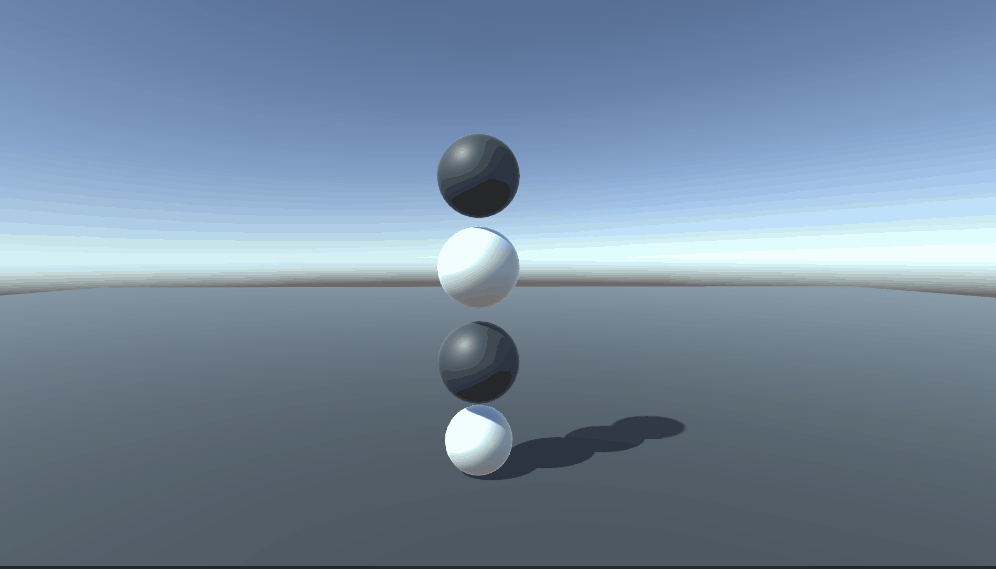

# StackingObjects
A custom constraint for stacking game objects on top of each other.

# How To Use
Attach the Stackable script to the object you wish to stack. Then decide the transform to constrain it to.

# How It Works?
This method utilizes custom constraint code in order to provide unrealistic joint behaviours. It solves numerical equations in order to find the appropriate velocity and quaternion to achieve the proper results. 